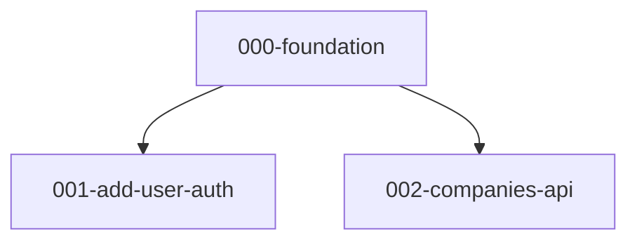

# Kanban Board + Issue DAG

Generate `issues/dag.md` (Mermaid graph + parallel lanes) and `issues/kanban.md` (review board) from `issues/NNN-*.md`.

## Invocation

- "Regenerate the issue DAG and kanban"
- "Refresh kanban from issues"
- "What can run in parallel?"
- "Set up / open the issue board viewer"

## Files

| Path | Role |
|------|------|
| `issues/NNN-*.md` | Input — issue files with frontmatter |
| `issues/dag.md` | Output — Mermaid DAG, parallel lanes, warnings |
| `issues/kanban.md` | Output — column-based review board |
| `issues/board.json` | Output — machine-readable for viewer/scripts |
| `issues/board-config.yaml` | Optional — override WIP/parallel limits |

Exclude `prd.md`, `dag.md`, `kanban.md`, `board.json` from the graph.

## Issue frontmatter

```yaml
---
id: "001"
title: "add-user-auth"
type: AFK              # AFK | HITL
status: backlog        # backlog | ready | in_progress | review | done
blocked_by:
  - "000-foundation.md"
parent_prd: "issues/prd.md"
---
```

- DAG edges: `blocked_by` → edge from blocker to this issue.
- Frontmatter is source of truth; `## Blocked by` in body should match. Warn on drift.
- Backfill: if frontmatter missing, infer from filename + body, write it back.

## Columns and WIP limits

Traditional pull-based kanban: work moves left → right; you pull into a column only when it has capacity.

| Column | WIP limit | Who moves cards here | Rule |
|--------|-----------|----------------------|------|
| **Backlog** | — | Auto | Has unfinished blockers |
| **Ready** | — | Auto | No open blockers; split into AFK / HITL sub-lanes |
| **In progress** | **4** | Agent (AFK) or User (HITL) | Actively being worked on |
| **Review** | **5** | Agent sets `review` when done | Waiting for human review |
| **Done** | — | User after review | Accepted / merged |

### HITL flow

HITL issues (design decisions, architecture calls, manual setup) follow the same columns but **only the user moves them**:

1. DAG promotes HITL issue to **Ready (HITL)** when blockers clear.
2. **You** pull it into **In progress** when you start working on it.
3. **You** move it to **Done** when finished (no Review needed — you are the reviewer).

Agent must never touch a HITL issue unless you explicitly name it.

### AFK flow

1. DAG promotes AFK issue to **Ready (AFK)** when blockers clear.
2. Agent pulls into **In progress** if WIP has capacity (< 4 in progress).
3. Agent sets `status: review` when implementation is ready.
4. You review and move to **Done** or back to **In progress** with feedback.

### Parallel lanes (DAG)

Default: agent may use up to **2** parallel AFK lanes without approval (each on its own `feat/NNN-slug` branch). More lanes require your OK.

### Override

Copy `board-config.example.yaml` → `issues/board-config.yaml`:

```yaml
wip:
  in_progress: 4       # column WIP limit (AFK + HITL combined)
  review: 5            # column WIP limit
parallel:
  max_lanes: 2         # AFK lanes agent can use without approval
```

Agent must not exceed column WIP. Flag over-limit columns in `kanban.md` and `board.json`.

On refresh: rebuild columns from frontmatter + DAG, but **preserve** manual placements unless DAG forces a move (blocker done → promote dependent to Ready).

## `issues/dag.md` shape

```markdown
# Issue DAG

> Regenerated YYYY-MM-DD

## Warnings
- (cycles, drift — or "None")

## Parallel lanes (ready now)
- Lane A: 001-add-user-auth.md, 004-health-check.md
- Lane B: 002-companies-api.md

## Stats
- Total: N | Ready (AFK): … | Ready (HITL): … | Blocked: …

## Mermaid
```



Style HITL nodes with dashed borders: `classDef hitl stroke-dasharray: 5 5`.

## `issues/kanban.md` shape

```markdown
# Kanban

> Regenerated YYYY-MM-DD

## Ready (AFK)
- [ ] [001-add-user-auth](001-add-user-auth.md)

## Ready (HITL)
- [ ] [003-auth-design](003-auth-design.md)

## In progress
- [ ] [002-companies-api](002-companies-api.md)

## Review
## Done
## Backlog
```

## `issues/board.json`

```json
{
  "generated_at": "2026-05-17T12:00:00Z",
  "limits": { "in_progress": 4, "review": 5, "parallel_lanes": 2 },
  "counts": { "in_progress": 1, "review": 0 },
  "stats": { "total": 5, "ready_afk": 2, "ready_hitl": 1, "blocked": 2 },
  "dag": {
    "mermaid": "flowchart TD\n  ...",
    "parallel_lanes": [["001-a.md", "004-b.md"], ["002-c.md"]]
  },
  "kanban": {
    "columns": [
      { "name": "Ready (AFK)", "over_limit": false, "issues": [{ "file": "001-a.md", "title": "...", "type": "AFK" }] }
    ]
  }
}
```

## Process

1. Load `issues/board-config.yaml` or defaults.
2. List `issues/NNN-*.md`; backfill frontmatter where missing.
3. Build DAG from `blocked_by`; detect cycles + drift.
4. Compute ready set and parallel lanes (independent issues with no path between them).
5. Apply WIP limits; flag over-limit.
6. Write `issues/dag.md`, `issues/kanban.md`, `issues/board.json`.
7. Summarize: ready counts, parallel lanes, limits status, warnings.

## "What can run in parallel?"

1. **Lane list** from `dag.md`
2. **Branch plan** — one `feat/NNN-slug` branch per parallel issue off `main`
3. **Limits snapshot** — current counts vs caps

## Web viewer (optional)

1. Copy `~/.cursor/skills/kanban-board/viewer/` → `tools/issue-board/` in the project.
2. Regenerate so `issues/board.json` exists.
3. `python -m http.server 8080` from repo root.
4. Open `http://localhost:8080/tools/issue-board/`

Loads `board.json`, renders Mermaid DAG + kanban columns, highlights limit violations.
